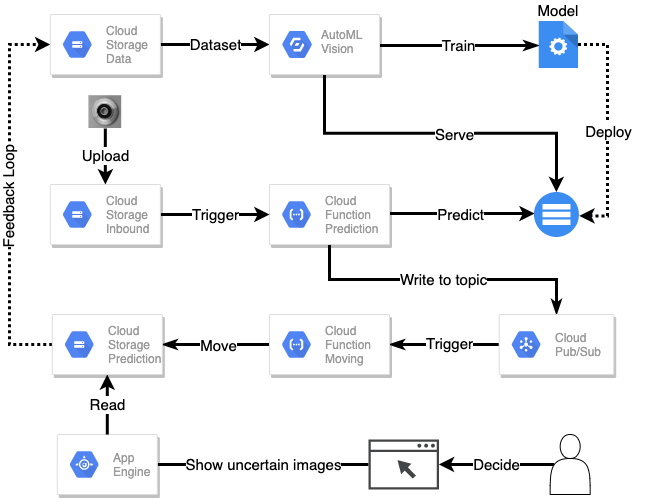
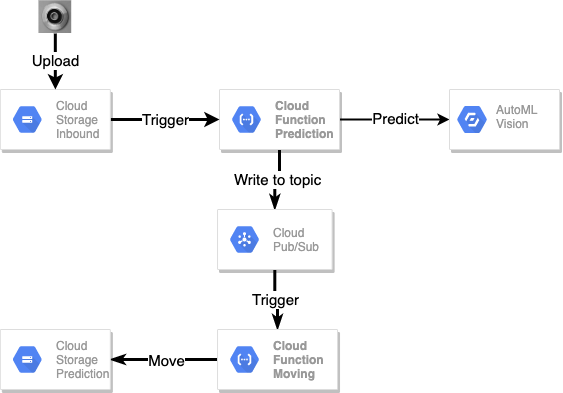

# Google Cloud Platform Automated Quality Inspection


This repository is a showcase about how to leverage the Google Cloud Platform (GCP) to train and deploy a machine learning project without any deep knowledge about machine learning frameworks. 
 The underlying use case is automated detection of defect components in manufacturing. For this purpose we upload pictures of the components to GCP. Then, we classify the image using a machine learning model. Images that are not classified with sufficient certainty by the model can be manually postprocessed using a simple user interface.

We utilizing different services of GCP such as [Cloud Storage](https://cloud.google.com/storage), [AutoML](https://cloud.google.com/automl), [Cloud Functions](https://cloud.google.com/functions), [Cloud Pub/Sub](https://cloud.google.com/pubsub) and [App Engine](https://cloud.google.com/appengine) to implement the machine learning system. The AutoML image classification model is trained on the [product image data for quality insepection](https://www.kaggle.com/ravirajsinh45/real-life-industrial-dataset-of-casting-product).

## Overview
- [app_engine](app_engine/): Demo application for deployment. For the implementation we use [fastapi](https://fastapi.tiangolo.com/) and [React](https://reactjs.org/) and deploy it on the [App Engine](https://cloud.google.com/appengine).
- [automl](automl/): All the code and instructions that are necessary to prepare for [AutoML](https://cloud.google.com/automl) image classification training.
- [cloud_functions](cloud_functions): Serverless cloud functions are used in order to predict and sort uploaded images. The functions are triggered by bucket upload and by a Pub/Sub topic, respectively.
- [data](data/): All the data that is used for this project. We use [this dataset](https://www.kaggle.com/ravirajsinh45/real-life-industrial-dataset-of-casting-product) from [kaggle](https://www.kaggle.com/) for the project. 
- [docs](docs/): Documentation.


## Prerequirements
You need access to GCP. In order to follow this tutorial create a new project in your account, setup [Google Cloud SDK](https://cloud.google.com/sdk/install) and get access to your project with your local shell.
```sh
gcloud init
gcloud auth application-default login
```
In the project enable the APIs for AutoML, GCS, Cloud Functions, App Engine and Pub/Sub.

Furthermore, you need a python 3.7 environment (conda or virtual env) with libraries specified in [requirements.txt](requirements.txt). You can install them with `pip install -r requirements.txt`.

## Tutorial
The tutorial consists three parts.

### 1. AutoML Preparation, Training and Deployment

Before we can train the AutoML Model we need to upload the data to GCS and prepare a CSV file with the location and labels of the data. Since AutoML is only available in the region `US-CENTRAL1`, we create a bucket in this region. Here, we require the environment variables. Bucket names in GCP are unique, therefore we prefix all bucket names with your - also unique - GCP project ID. 

```sh
export GCP_REGION="US-CENTRAL1"
export GCP_PROJECT_ID="<fill-with-your-project-id>"
export TRAINING_DATA_BUCKET="$GCP_PROJECT_ID""-product-quality"
``` 

1. Download the [dataset](https://www.kaggle.com/ravirajsinh45/real-life-industrial-dataset-of-casting-product) and put it inside the [data](data/)-folder. Extract the zip file.
```
data
└── casting_data
    ├── test
    │   ├── def_front
    │   │   ├── ....
    │   │   └── new__0_9334.jpeg
    │   └── ok_front
    │       ├── ....
    │       └── cast_ok_0_9996.jpeg
    └── train
        ├── def_front
        │   ├── ...
        │   └── cast_def_0_9997.jpeg
        └── ok_front
            ├── ...
            └── cast_ok_0_9998.jpeg
```

2. Create a GCS bucket and upload the data:
```sh
gsutil mb -l $GCP_REGION gs://"${TRAINING_DATA_BUCKET}"
gsutil -m cp -r data/ gs://"${TRAINING_DATA_BUCKET}"
```

3. Prepare CSV file for AutoML classification. The CSV file consists of the three columns: 
- `SET`: This is an optional field with fixed values to decide which sample belongs in which set. The fixed values are `TRAIN`, `VALIDATION` and `TEST`. If we don't assign this field AutoML will divide the dataset into 8:1:1. If we assign this field, it is necessary to use all of these values.
- `IMAGE PATH`: The path of the image in GCP.
- `LABEL`: The label of a sample.

We wrote a script [prepare.py](automl/prepare.py) to generate this CSV file based on the blobs in the specified bucket. You can execute this script with
```
python automl/prepare.py
```

Finally, we need to upload this CSV file into the GCS with the following command:
```sh
tail preparation.csv
...
TRAIN,gs://product-quality/data/casting_data/train/def_front/cast_def_0_3105.jpeg,Defect
VALIDATION,gs://product-quality/data/casting_data/train/def_front/cast_def_0_3107.jpeg,Defect
TEST,gs://product-quality/data/casting_data/test/ok_front/cast_ok_0_9996.jpeg,Ok

gsutil cp preparation.csv gs://$TRAINING_DATA_BUCKET
```

4. Create a dataset in AutoML Vision. Assign it a name and select *Single-Label Classification* 


5. Import the data into the dataset. For the import we need to the select the CSV file that was generated and uploaded to GCS. The import will take some time (~20 Minutes). 

After the import we can see the images in AutoML.
 

6. For the training of the model we select the *Cloud hosted* option. This has the benefit that the model can be deployed directly inside GCP. We set the *node hour budget* to 8 which is the minimum amount of node hours. Be careful with this setting because the costs are \$3.15 per node hour. In our case, the maximum cost is capped at \$25.2. Based on the performance of the model on the validation dataset, AutoML will stop the training and you are only charged for the actual training time. After the training we can evaluate the model, inspect the results and deploy the model. 
 

### 2. Cloud Functions



For our setup, we require two cloud functions. The first function classifies new images via the AutoML model and publishes the prediction result to Pub/Sub. The second function takes the prediction results and distributes the inbound pictures accordingly.

#### Prediction

The [predict](cloud_functions/predict) function triggers for each picture that is uploaded to the inbound bucket. It downloads the picture and requests a classification from the AutoML model. Because the model response is serialized with [protocol buffers](https://developers.google.com/protocol-buffers) we utilise the python package [protobuf-to-dict](https://pypi.org/project/protobuf-to-dict/) to deserialize the response in python. Finally, the result of the classification is published to a Pub/Sub topic. We publish messages of the form.
```
msg = {
    "bucket_name": data["bucket"],
    "image_name": data["name"],
    "prediction_label": result.get("display_name"),
    "prediction_score": result.get("classification").get("score"),
}
```
In order to deploy the function we require the environment variables
```
export MODEL_ID="ICN690530685638672384"

export INBOUND_BUCKET="$GCP_PROJECT_ID""-product-quality-inbound"
export PREDICTION_TOPIC="automl_predictions"
export PREDICT_CLOUD_FUNCTION_PATH="cloud_functions/predict"
export PREDICT_CF_NAME="predict_image"
```
Here, the `MODEL_ID` is specified by the deployed AutoML model from the previous step. You can lookup the `MODEL_ID` in the AutoML UI. Whereas the names for the bucket `INBOUND_BUCKET` and Pub/Sub topic name `PREDICTION_TOPIC` can be chosen freely.
 Furthermore, the values for `PREDICT_CLOUD_FUNCTION_PATH` and `PREDICT_CF_NAME` don't have to be changed.

We create the bucket and the Pub/Sub topic with
```
gsutil mb -l $GCP_REGION gs://"${INBOUND_BUCKET}"
```
and
```
gcloud pubsub topics create "$PREDICTION_TOPIC"
```
Then, we deploy the cloud function using
```
gcloud functions deploy "$PREDICT_CF_NAME" \
 --source "$PREDICT_CLOUD_FUNCTION_PATH" \
 --runtime python37 \
 --trigger-resource "$INBOUND_BUCKET" \
 --trigger-event google.storage.object.finalize \
 --set-env-vars model_id="$MODEL_ID",topic_id="$PREDICTION_TOPIC"
```

When you get an error that `service-<project-number>@gcf-admin-robot.iam.gserviceaccount.com does not have storage.objects.create access to the Google Cloud Storage object.` please add the `Storage Object Creator` to the service account. Also, allow unauthenticated invocations of new function. 

#### Moving


The [move](cloud_functions/move) function triggers for new events on the Pub/Sub topic. Because we obtain the events from the topic directly we first have to decode the [base64](https://docs.python.org/3/library/base64.html) encoded events. Then, the function moves the picture into the respective subfolder in the prediction bucket and deletes it from the inbound bucket. Here, we explicitly check if the prediction score is above a given threshold. We move images with low score into a special folder for manual postprocessing because we only trust predictions with a high score for automated processing. The resulting folder structure looks as follows.   
```
prediction_bucket
├── ok
│   └── new_pic_4566.jpeg
│   └── new_pic_2353.jpeg
│   └── ...
├── defect
│   └── new_pic_3546.jpeg
│   └── new_pic_2453.jpeg
│   └── ...
└── unclear
    └── new_pic_1452.jpeg
    └── new_pic_1245.jpeg
    └── ...
```


We require the following environment variables for deploying the function.
```
export PREDICTION_BUCKET="$GCP_PROJECT_ID""-product-quality-prediction"
export PREDICTION_THRESHOLD="0.8"

export MOVE_CLOUD_FUNCTION_PATH="cloud_functions/move"
export MOVE_CF_NAME="move_image"
```
Here, the name for the bucket `PREDICTION_BUCKET` can be chosen freely. The `PREDICTION_THRESHOLD` defines the threshold for predictions that we consider unclear. Again, the values for `MOVE_CLOUD_FUNCTION_PATH` and `MOVE_CF_NAME` don't have to be changed.

We create the prediction bucket with
```
gsutil mb -l $GCP_REGION gs://"${PREDICTION_BUCKET}"
```


Finally we can deploy the function with
```
gcloud functions deploy "$MOVE_CF_NAME" \
 --source "$MOVE_CLOUD_FUNCTION_PATH" \
 --runtime python37 \
 --trigger-topic "$PREDICTION_TOPIC" \
 --set-env-vars prediction_bucket="$PREDICTION_BUCKET",prediction_threshold="$PREDICTION_THRESHOLD"
```

### 3. App Engine 


We serve an online application that can be used for reviewing images in the `unclear` folder, i.e., that have been classified by the model with a score below the chosen threshold. 

The server is written in Python using the [fastapi](https://fastapi.tiangolo.com/) framework. Through the server we serve a static page that is using React to display an image and as an user we can decide if the image is `defect` or `ok`. On the server side we retrieve the image from the `PREDICTION_BUCKET` and generate a pre-signed url that can be loaded directly from React. The server is deployed with App Engine. 

#### Preparation
1. First, we require a key to access GCS from App Engine. By default App Engine will create a service account that can be looked up under `Service Accounts`. Usually this account is named as `${PROJECT_ID}@appspot.gserviceaccount.com`. Download the key put in inside the [app_engine folder](app_engine/) with the name `app_engine_service_account.json`. Important: don't share this key with anyone nor put it in the github repository. 

2. In the storage browser we need to give the service account the role `Storage Object Viewer` and `Storage Legacy Bucket Writer` for the `PREDICTION_BUCKET` to view and edit blobs.
3. In the IAM give the service account the role `Service Account Token Creator` to allow the generation of the pre-signed urls. 


#### Deployment
1. Ensure that the generated key `app_engine_service_account.json` is inside the [app_engine folder](app_engine/).
2. Adjust the bucket name in [app.yaml](app_engine/app.yaml).
3. Run `gcloud app deploy app_engine/app.yaml` and the application should be live after a few seconds. You can directly open the application from the terminal with `gcloud app browse`.

Now we have the application running. By clicking `Ok`/`Defect` the image will be saved inside the bucket with the `ok`/`defect` label. After each click a new image will be loaded.
4. After the manual decision was made the app moves the image to the folder `human_decided` inside the `PREDICTION_BUCKET` with the prefix of the label.
    ```
    prediction_bucket
    ├── ok
    │   └── ...
    ├── defect
    │   └── ...
    ├── unclear
    │   └── ...
    └── human_decided
        └── ok_new_pic_1452.jpeg   
        └── defect_new_pic_1453.jpeg
    ```

#### Troubleshooting
For any kind of troubleshooting of the app engine run `gcloud app logs tail -s default` to retrieve the logs.

#### Testing
The simplest way to test the web application is to put an image inside the `$PREDITION_BUCKET/unclear`. 


