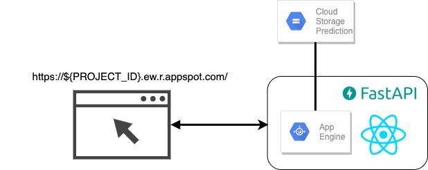

# Google Cloud Platform Automated Image Quality Inspection
This repository is showcase about how to leverage google cloud platform to quickly train and deploy a machine learning project. We are using different components of gcp such as [App Engine](https://cloud.google.com/appengine), [AutoML](https://cloud.google.com/automl), [Cloud Storage](https://cloud.google.com/storage), [Cloud Pub/Sub](https://cloud.google.com/pubsub) and [Cloud Functions](https://cloud.google.com/functions) are used to implement an end-to-end machine learning project. Based on this [dataset](https://www.kaggle.com/ravirajsinh45/real-life-industrial-dataset-of-casting-product) we train an AutoML image classification model and deploy it through AutoML.

## Overview
- [app_engine](app_engine/): Demo application for deployment. For the implementation we use [fastapi](https://fastapi.tiangolo.com/) and [React](https://reactjs.org/) and deploy it on the [App Engine](https://cloud.google.com/appengine).
- [automl](automl/): All the code and instructions that are necessary to prepare for [AutoML](https://cloud.google.com/automl) image classification training.
- [cloud_functions](cloud_functions):
- [data](data/): All the data that is used for this project. We used [product image data for quality insepection](https://www.kaggle.com/ravirajsinh45/real-life-industrial-dataset-of-casting-product) from [kaggle](https://www.kaggle.com/) for this project. 
- [docs](docs/): Find the documentation images. 


## Prerequirements
You need access to the Google Cloud Platform. Create a new project and get access to the project with your local shell.
```sh
gcloud init
gcloud auth application-default login
```

Enable the APIs for AutoML, GCS, Cloud Functions, App Engine and Pub/Sub.

## Tutorial
There are X parts in this tutorial. We need to set the following configurations:
```sh
export PROJECT_ID="vigilant-shift-280708"
export BUCKET_LOCATION="US-CENTRAL1"
export BUCKET_NAME="product-quality"
```

### 1. AutoML Preparation, Training and Deployment
1. Download the [dataset](https://www.kaggle.com/ravirajsinh45/real-life-industrial-dataset-of-casting-product) and put it inside the [data](data/)-folder. Extract the zip file.
```
data
└── casting_data
    ├── test
    │   ├── def_front
    │   │   ├── ....
    │   │   └── new__0_9334.jpeg
    │   └── ok_front
    │       ├── ....
    │       └── cast_ok_0_9996.jpeg
    └── train
        ├── def_front
        │   ├── ...
        │   └── cast_def_0_9997.jpeg
        └── ok_front
            ├── ...
            └── cast_ok_0_9998.jpeg
```

2. Create a GCS bucket and upload the data:
```sh
gsutil mb -p $PROJECT_ID  -l $BUCKET_LOCATION -b on gs://$BUCKET_NAME
gsutil -m cp -r ../data gs://$BUCKET_NAME
```

3. Prepare CSV file for AutoML classification. The CSV file consists of the three columns: ,  and `Label`.
- `SET`: This is an optional field with fixed values to decide which sample belongs in which set. The fixed values are `TRAIN`, `VALIDATION` and `TEST`. If we don't assign this field AutoML will divide the dataset into 8:1:1. If we assign this field, it is necessary to use all of these values.
- `GCS Location`: The location of the image on the GCP.
- `LABEL`: The label of a sample.

We wrote a script [prepare.py](automl/prepare.py) to generate this CSV file based on the blobs in the specified bucket. We need to upload this CSV file into the GCS with the following command:
```sh
tail automl/preparation.csv
...
TRAIN,gs://product-quality/data/casting_data/train/def_front/cast_def_0_3105.jpeg,Defect
VALIDATION,gs://product-quality/data/casting_data/train/def_front/cast_def_0_3107.jpeg,Defect
TEST,gs://product-quality/data/casting_data/test/ok_front/cast_ok_0_9996.jpeg,Ok

gsutil cp preparation.csv gs://$BUCKET_NAME
```

4. Create a dataset in AutoML Vision. Assign it a name and select *Single-Label Classification* 


5. Import the data into the dataset. For the import we need to the select the CSV file that was generated and uploaded to GCS. The import while take some time (~20 Minutes). 

After the import we can see the images in AutoML.
 

6. Training the model. For the training of the model we will select the *Cloud hosted* option. This has the benefit that the model can be deployed directly inside the GCP and we don't have care about the deployment by ourself. Also we need to set a *node hour budget*. In our case we set it to 8 which is the minimum of allowable node hours. Be careful here because the costs are \$3.15 per node hour. The maximum cost is \$25.2. Based on the validation dataset if the improvement of the model steps are too slow AutoML will stop the training and your only charged for the training time. After the training we can evaluate the model, inspect the results and deploy the model. 
 

### 2. Cloud Functions

In this setup, we require two cloud functions. The first function classifies new images via the AutoML model and publishes the prediction result to pubsub. The second function takes the prediction results and distributes the inbound pictures accordingly.

#### Prediction

The [predict](cloud_functions/predict) function triggers for each picture that is uploaded to the inbound bucket. It downloads the picture and requests a classification from the AutoML model. Because the model response is serialized with [protocol buffers](https://developers.google.com/protocol-buffers) we utilise the python package [protobuf-to-dict](https://pypi.org/project/protobuf-to-dict/) to deserialize the response in python. Finally, the result of the classification is published to a pubsub topic with messages of the following form.
```
msg = {
    "bucket_name": data["bucket"],
    "pic_name": data["name"],
    "prediction_label": result.get("display_name"),
    "prediction_score": result.get("classification").get("score"),
}
```
In order to deploy the function we require the environment variables
```
export MODEL_ID="ICN690530685638672384"

export INBOUND_BUCKET="pump_impeller_inbound_bucket"
export PREDICTION_TOPIC="automl_predictions"
export PREDICT_CLOUD_FUNCTION_PATH="cloud_functions/predict"
export PREDICT_CF_NAME="predict_pic_cf"
```
Here, the `MODEL_ID` is specified by the deployed AutoML model from the previous step.  Whereas the names for the bucket `INBOUND_BUCKET` and pubsub topic name `PREDICTION_TOPIC` can be chosen freely.
 Furthermore, the values for `PREDICT_CLOUD_FUNCTION_PATH` and `PREDICT_CF_NAME` don't have to be changed.

Then, we can deploy the cloud function using
```
gcloud functions deploy "$PREDICT_CF_NAME" \
 --source "$PREDICT_CLOUD_FUNCTION_PATH" \
 --runtime python37 \
 --trigger-resource "$INBOUND_BUCKET" \
 --trigger-event google.storage.object.finalize \
 --set-env-vars model_id="$MODEL_ID",topic_id="$PREDICTION_TOPIC"
```

#### Moving

The [move](cloud_functions/move) function triggers for new events on the pubsub topic. Because we obtain the events from the topic directly we first have to decode the [base64](https://docs.python.org/3/library/base64.html) encoded events. Then, the function moves the picture into the respective subfolder in the prediction bucket and deletes it from the inbound bucket. Here, we explicitly check if the prediction score is above a given threshold. Because we only trust predictions with a high score for automated processing. We move images with low score into a special folder for manual postprocessing. The resulting folder structure looks as follows.   
```
prediction_bucket
├── ok
│   └── new_pic_4566.jpeg
│   └── new_pic_2353.jpeg
│   └── ...
├── defect
│   └── new_pic_3546.jpeg
│   └── new_pic_2453.jpeg
│   └── ...
└── unlcear
    └── new_pic_1452.jpeg
    └── new_pic_1245.jpeg
    └── ...
```


We require the following environment variables for deploying the function.
```
INBOUND_BUCKET="pump_impeller_inbound_bucket"
PREDICTION_THRESHOLD="0.8"

MOVE_CLOUD_FUNCTION_PATH="cloud_functions/move"
MOVE_CF_NAME="move_pic_cf"
```
Here, the name for the bucket `INBOUND_BUCKET` can be chosen freely. The `PREDICTION_THRESHOLD` defines the threshold for predictions that we consider unclear. Again, the values for `MOVE_CLOUD_FUNCTION_PATH` and `MOVE_CF_NAME` don't have to be changed.

Finally we can deploy the function with
```
gcloud functions deploy "$MOVE_CF_NAME" \
 --source "$MOVE_CLOUD_FUNCTION_PATH" \
 --runtime python37 \
 --trigger-topic "$PREDICTION_TOPIC" \
 --set-env-vars prediction_bucket="$PREDICTION_BUCKET",prediction_threshold="$PREDICTION_THRESHOLD"
```

### 3. App Engine 

We want to serve an online application that can be used for reviewing images that could not have been classified by the model.  The server is written in Python using the fastapi framework. Through the server we serve a static page that is using React to display an image and as an user we can decide if the image is defect or ok. On the server side we retrieve the image from a GCS bucket and generate a presigned url that can be loaded directly from React. 
#### Preparation
1. Generate a key to access. By default app engine will create a service account that can be looked up under `Service Accounts`. Usually this account is denoted as `${PROJECT_ID}@appspot.gserviceaccount.com`. We need to create a key that is used in the app engine later. Important: don't share this key with anyone nor put it in the github repository. 

2. In the storage browser we need to give the service account the role `Storage Bucket Viewer` and `Storage Legacy Bucket Writer` to view and edit blobs.

#### Deployment
1. Put the generated key inside the [app_engine folder](app_engine).
2. Run `gcloud app deploy` and the application should be live after the deployment. You can directly open the application from the terminal with `gcloud app browse`.

Now we have the application running. By clicking `Ok`/`Defect` the image will be saved inside the bucket with the `ok`/`defect` label. After each click a new image will be loaded.

#### Troubleshooting
For any kind of troubleshooting of the app engine run `gcloud app logs tail -s default` to retrieve the logs.


